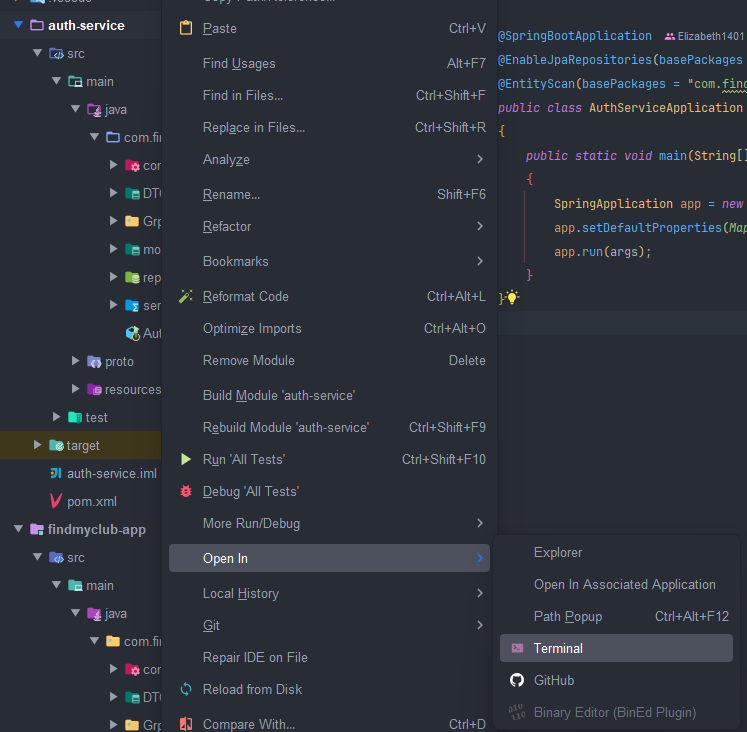
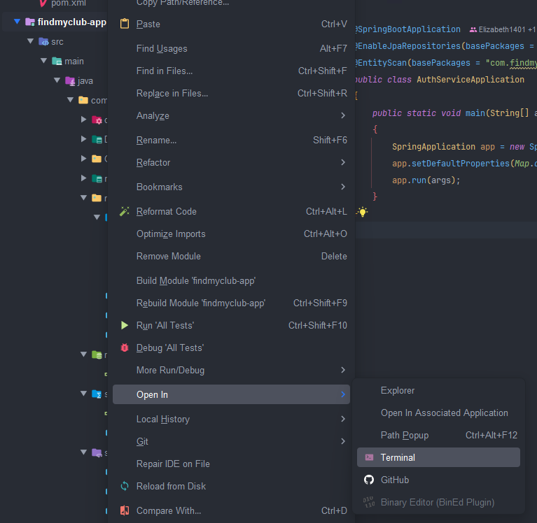
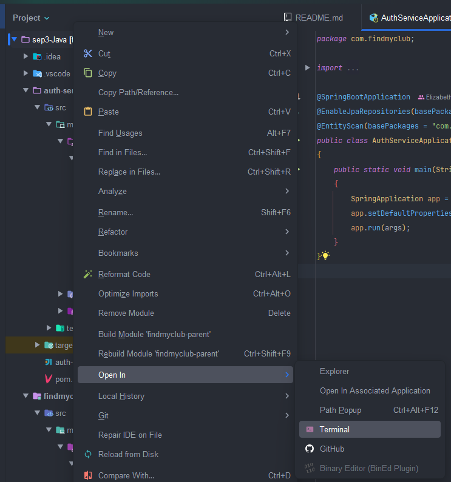

*SEP3 - How to install the dependencies for the two modules*

1. After cloning the repository, open the terminal for the auth-service module
   and run the following command to install the dependencies:
   ```
   mvn clean install
   ```
   To open the terminal: Right-click on the "auth-service" module folder and
   select "Open in" and choose the Terminal or navigate to the auth-service
   directory using the terminal.

   You can also see in the picture below:
   

2. After that, navigate to the "findmyclub-app" module folder and run the same
   command to install the dependencies:
   ```
   mvn clean install
   ```
   You can also see in the picture below:
   

3. After installing the dependencies for both modules, go to the terminal for
   the whole project and execute the command to compile and run both modules:
   ```
   mvn compile
   ```
   You can also see in the picture below:
   
   This will ensure that all necessary dependencies are installed and the
   project is set up correctly for development and testing, since each module
   has one "pom.xml" file that manages its dependencies using Maven and in the
   root we have the "pom.xml" parent file.

4. Finally, to run both modules, you can just do the same as described in the
   README.md file.
