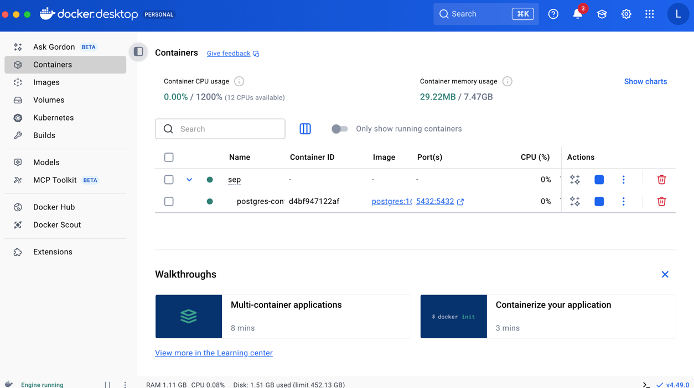

SEP3project

**How to use Docker to work with PostgresSQL?**

1. Download docker
If you don’t have Docker installed yet:

Windows / macOS → download Docker Desktop:
👉 https://www.docker.com/products/docker-desktop

Linux → follow the instructions for your distro:
👉 https://docs.docker.com/engine/install/

After installation, open a terminal and check 
docker --version
docker compose version

2. Open Docker Desktop
3. Navigate to the file docker-compose and run it
4. You should see the following in the Docker Desktop 
5. Well done, the database is ready to be used. No need to install it locally
6. Run the application and play with the APIs (using Postman)

**How to use Postman to test the API endoiint?**

1. Download Postman https://www.postman.com/downloads/
2. Create an account
3. Create a few GET, PUT, PATCH, DELETE and POST requests

